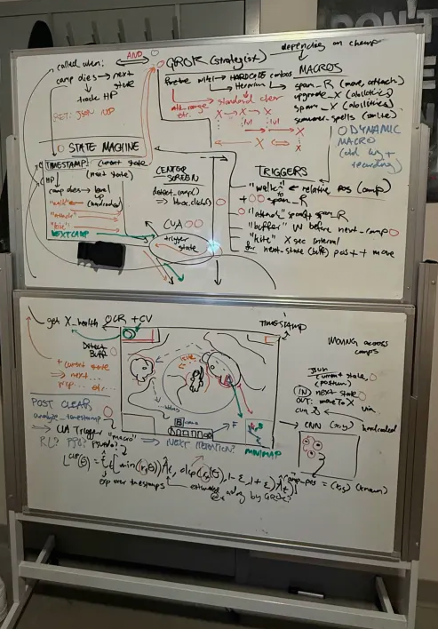
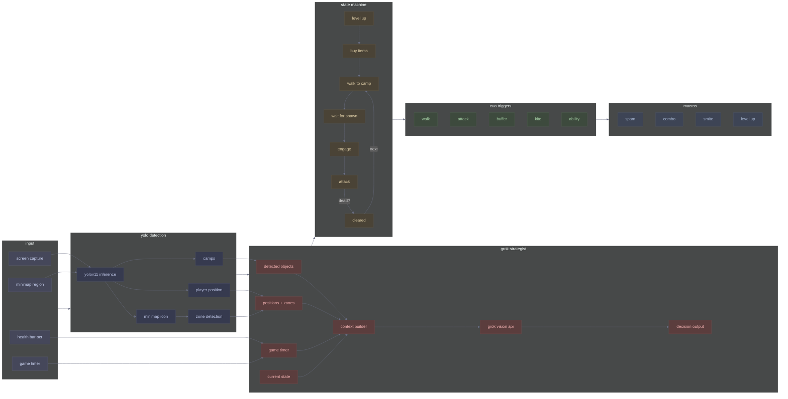
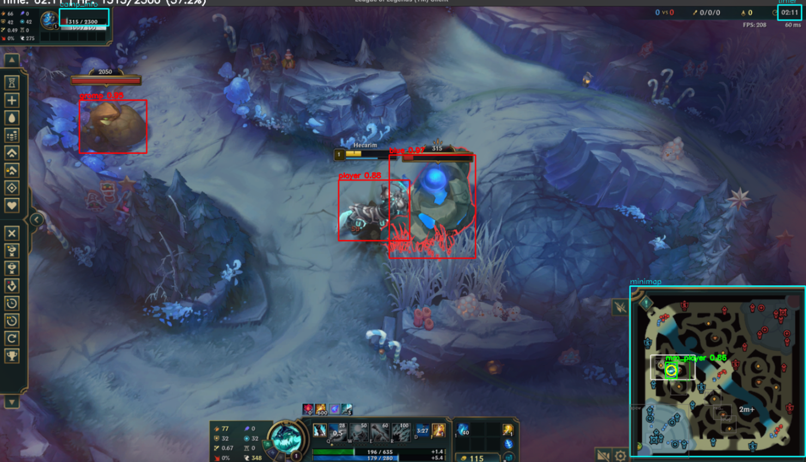
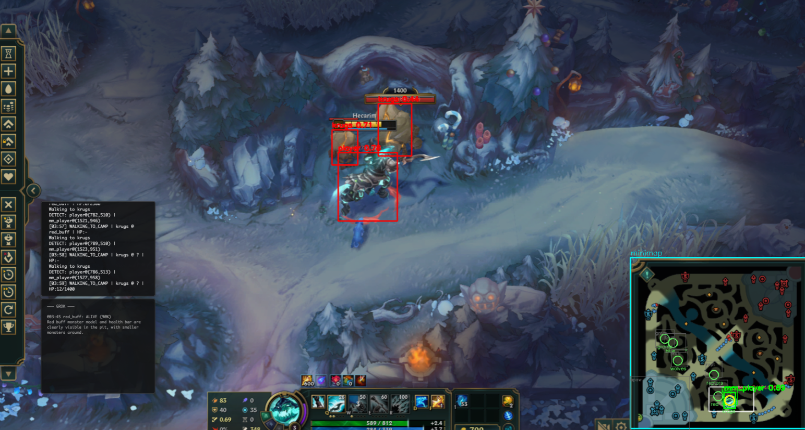
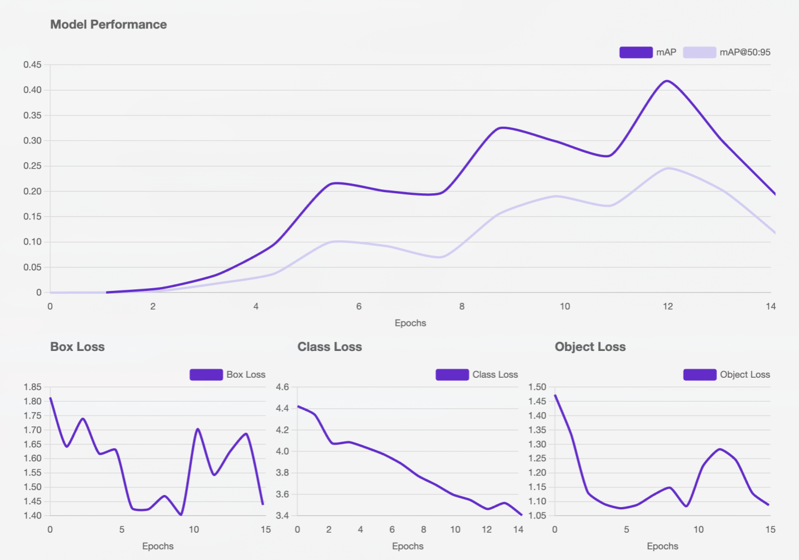
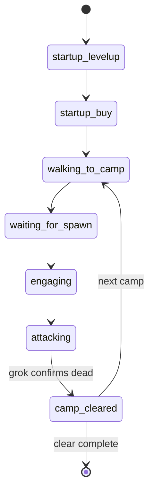

# gclear

a league of legends jungle bot that uses yolo for object detection and grok for decision-making.

<p align="center">
<br/>
<a href="https://youtu.be/nF_G7priALU">watch the full explainer</a>
</p>

<div align="center">
<table>
<tr>
<td align="center">
<strong>sub 3 min clear</strong><br/><br/>

</td>
<td align="center">
<strong>original whiteboarding</strong><br/><br/>

</td>
</tr>
</table>
</div>

---

## overview

gclear automates jungle clearing by combining two systems: a yolo model trained to detect camps and player position, and grok as a vision-language model that interprets game state and outputs actions.

the bot captures frames, runs detection, and passes the annotated frame to grok. grok then determines state transitions (attacking, walking, buying), target selection, and pathing. this replaces hardcoded logic with a model that can reason about what it sees.

## system architecture



↑ <small>*frame + bounding boxes + confidence scores*</small>



| color | layer |
|-------|-------|
| gray | input - raw game data |
| slate | detection - yolo inference |
| red | strategist - grok decisions |
| amber | state - game loop states |
| green | triggers - cua actions |
| steel | macros - automated inputs |

## how it works

### detection layer

yolo runs inference on game frames to identify:

| class | detection |
|-------|-----------|
| `player` | champion position on screen |
| `mm_player` | minimap icon position |
| `blue` | blue sentinel |
| `red` | red brambleback |
| `gromp` | gromp |
| `wolves` | wolf camp |
| `raptors` | raptor camp |
| `krugs` | krug camp |

trained on 83 hand-labeled frames from a hecarim clear, augmented to ~247 images.



### model training

trained yolov11 on roboflow with the following results:

<table>
<tr>
<td colspan="2" align="center">
<strong>metrics</strong><br/><br/>

</td>
</tr>
<tr>
<td align="center">
<strong>training data</strong><br/><br/>

</td>
<td align="center">
<strong>performance</strong><br/><br/>

</td>
</tr>
</table>

### grok as the brain

grok receives:
- current game frame
- detected objects and positions
- zone probabilities from minimap analysis
- game timer
- current state context

grok decides:
- what state to transition to (attacking, walking, buying, kiting)
- which target to focus
- when a camp is dead and it's time to move
- ability usage and timing
- pathing decisions

the bot streams grok's chain-of-thought to an overlay so you can watch it reason through decisions in real-time.

### state machine



default clear: `blue → gromp → wolves → raptors → red → krugs`

### action triggers

the cua layer translates grok decisions into game inputs:

| trigger | action |
|---------|--------|
| `walk` | click relative position to camp |
| `attack` | right click on detected target |
| `buffer` | queue W ability before arriving at camp |
| `kite` | timed movement between auto attacks |
| `ability` | q/w/e/r on cooldown or condition |
| `smite` | f key when camp hp threshold met |

### overlay system

two persistent overlays:
- **bot status**: current state, recent actions
- **grok thoughts**: streaming reasoning as decisions happen

## project structure

```
gclear/
├── src/gclear/
│   ├── bot.py           # state machine + game loop
│   ├── strategist.py    # grok integration
│   ├── overlay.py       # pyqt6 overlays
│   ├── som.py           # minimap positions
│   └── data_collection/ # labeling tools
├── tests/
├── media/
├── logs/
└── docs/
```

## running

```bash
uv sync
export XAI_API_KEY="your_key"
uv run python src/gclear/bot.py
```

requires python 3.12+, macos, tesseract ocr.

## ideas / next steps

### better training data

the current dataset is 83 hand-labeled frames from a single hecarim clear. this works for basic camp detection but doesn't generalize well. need frames from different champions, different skins, different game times (lighting changes throughout the match), and edge cases like camps mid-death animation or partially obscured by ability effects.

### minimap state inference

right now the bot only looks at where the player icon is on the minimap. but there's way more information there - enemy positions, or more importantly, the absence of enemy positions. if mid laner was visible bot side 10 seconds ago and now they're gone, where are they? recalled? roaming through jungle? setting up a gank?

chess engines solve this with evaluation functions - hardcoded weights for piece positions, king safety, pawn structure. but league is too dynamic for static heuristics. champion matchups, power spikes, item breakpoints, objective timers all shift what's "good" moment to moment. the idea is to give grok a rolling window of minimap states and let it reason about probable enemy positions and threat levels.

### pre-game planning

jungle pathing isn't solved in isolation. it depends on team comps, lane matchups, and win conditions. a team with strong early lanes wants the jungler to path toward them for dives. a scaling comp wants safe farming. grok could analyze the loading screen, identify the matchups, and generate a clear path before the game even starts. adjust for expected invade routes based on enemy jungler identity.

### invade detection and adaptation

current bot follows a fixed clear order. if the enemy jungler shows up at your red buff, it doesn't know what to do. grok needs to recognize when the plan is compromised and generate a new one - vertical jungle, skip the contested camp, or fight for it depending on 1v1 matchup and nearby lane priority.

### multi-champion support

hecarim has a specific clear pattern - he can full clear quickly and wants to spam q on cooldown. other junglers play completely differently. karthus wants to kite camps and stay at range. lee sin wants to animation cancel and manage energy. the detection model needs to generalize across champions, and grok needs to understand different kits and their optimal clear patterns.

### learning from vods

pro junglers make thousands of micro-decisions per game that aren't documented anywhere. the idea is to feed grok vods with timestamps - "at 3:42, showmaker's jungler paths top side after seeing bot lane push in" - and have it extract the reasoning. build a corpus of decision patterns that inform real-time play.

### benchmarking

need concrete metrics. clear time compared to human players, gold efficiency, health remaining after full clear. right now there's no baseline to measure improvement against.
